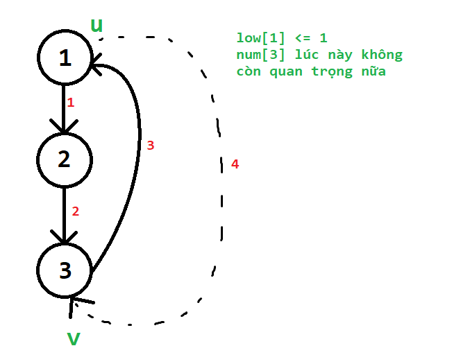
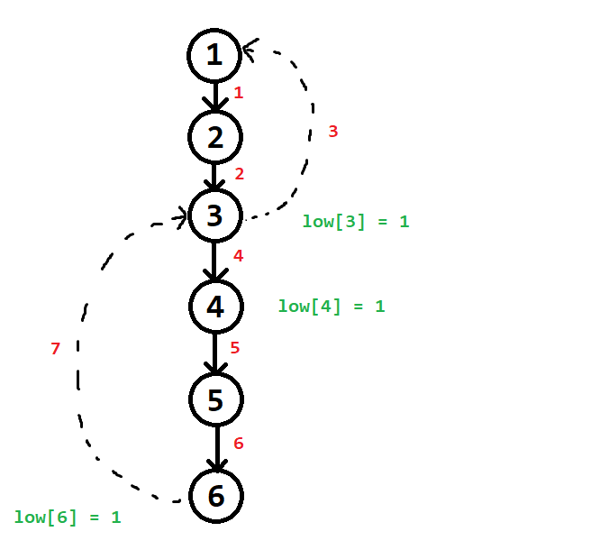
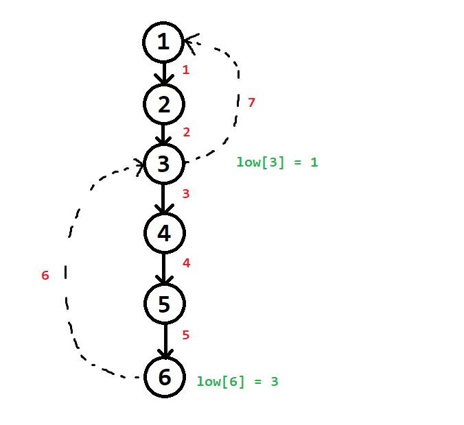

# Bài toán
Tìm cạnh cầu và đỉnh khớp

### Input

Dòng đầu nhập $n$ là số đỉnh, $m$ là số cạnh trong đồ thị $G$

$m$ dòng tiếp theo, mỗi dòng ghi hai số $u$, $v$, là các cặp cạnh trong $G$

Biết $G$ là đồ thị vô hướng

### Output

Cho biết các cạnh cầu và đỉnh khớp của $G$

# Code

```cpp
#include <bits/stdc++.h>
#define up(i,a,b) for (int i = (a); i <= (b); i++)
#define pii pair<int, int>
#define f first
#define s second
using namespace std;

const int maxn = 1e5 + 10;
vector<int> a[maxn];
int n,m;

int low[maxn];
int num[maxn];
int par[maxn];
int tdfs;

vector<pii> bridge;
vector<int> joint;
int root;

void DFS(int u){
    int isolated = (u != root);
    low[u] = num[u] = ++tdfs;
    for (int v : a[u]){
        if (v == par[u]) continue;
        if (!num[v]){
            par[v] = u;
            DFS(v);
            low[u] = min(low[u], low[v]);
            if (low[v] > num[u]){
                bridge.push_back({min(u, v), max(u, v)});
            }
            if (low[v] >= num[u]) ++isolated;
        }
        else low[u] = min(low[u], num[v]);
    }
    if (isolated > 1) joint.emplace_back(u);
}

signed main (){
    ios_base::sync_with_stdio(false);
    cin.tie(0);
    #define Task "A"
    if (fopen(Task".inp", "r")){
        freopen(Task".inp", "r", stdin);
        freopen(Task".out", "w", stdout);
    }

    cin >> n >> m;

    up(i,1,m){
        int u,v;
        cin >> u >> v;
        a[u].emplace_back(v);
        a[v].emplace_back(u);
    }

    up(i,1,n) if (!num[i]){
        root = i;
        DFS(i);
    }

    cout << bridge.size() << "\n";
    for (auto x : bridge){
        cout << x.f << " " << x.s << "\n";
    }

//    cout << joint.size() << "\n";
//    for (auto x : joint) cout << x << " ";

    return 0;
}
```

# Notes:

## Chú ý 1:
Một cạnh ngược trên cây DFS sẽ được thuật toán "chạy qua" $2$ lần


Rất nhiều người nghĩ là cạnh ngược chỉ đi một lần là lượt thăm số $3$, chứ không có lượt thăm số $4$. 

Lý do cho hiện tượng thăm hai lần này chính là do cách cài đặt của thuật toán. 

Để xem có cạnh ngược vào đi vòng qua $u$ lên tổ tiên của $u$ không, thuật toán vẫn cho phép một đỉnh $v$ có $num[v] \neq 0$ có thể được chạm tới từ một đỉnh khác trong quá trình duyệt cây.

Điều này vô tình làm cho một cạnh ngược bị xét qua hai lần.

Tại lượt duyệt 3:
- $low[u] = min(low[u], num[v])$.
- Lúc này sẽ $low[u]$ sẽ được cập nhật theo đúng định nghĩa của $low[]$.


Tại lượt duyệt $4$:
- $low[u] = min(low[u], num[v])$.
- Việc cập nhật sẽ không còn ý nghĩa nữa, vì lúc này $low[u]$ luôn nhỏ hơn hoặc bằng $num[v]$ mất rồi.



Như vậy:

$1.$ Việc cạnh ngược bị duyệt qua hai lần này không ảnh hưởng đến tính đúng của thuật toán. 

$2.$ $low[u]$ vẫn chỉ được update khi đang xét cạnh ngược lần thứ nhất

## Chú ý 2:
Giả sử ta để điều kiện kiểm tra xem $(u, v)$ có phải cạnh cầu hay không ra bên ngoài điều kiện $\text{if (num[v] != 0)}$ như sau:
```cpp
for (int v : a[u]){
    if (v == par[u]) continue;
    if (!num[v]){
        ...
        low[u] = min(low[u], low[v]);
        ...
    }
    else low[u] = min(low[u], num[v]);
    if (low[v] > num[u]){ //Đặt điều kiện kiểm tra cầu ra bên ngoài điều kiện (!num[v])
        bridge.push_back({min(u, v), max(u, v)});
    }   
}
```

Thì kết quả của bài toán tìm cầu vẫn đúng

### Lý do:

Việc đặt điều kiện kiểm tra cạnh cầu ra bên ngoài điều kiện $\text{if (num[v] != 0)}$, tương đương với việc ta xét cả hai trường hợp cung xuất hiện tại đỉnh $u$:

1. cung xuôi ($v$ là đỉnh chưa thăm trong quá trình DFS từ $u$ đến $v$)
2. cung ngược ($v$ là đỉnh đã thăm trong quá trình DFS từ $u$ đến $v$) 

Theo thiết kế cây DFS, một cung ngược không bao giờ là cạnh cầu, chỉ có cung xuôi mới có khả năng trở thành cạnh cầu.

Do đó, việc đặt điều kiện kiểm tra cung xuôi $(u - v)$ là cạnh cầu ra bên ngoài giống không ảnh hưởng đến tính đúng đắn trong việc tìm cầu.

Chỉ là mình phải check cả cung xuôi và cung ngược, check nhiều trường hợp thừa thãi hơn thôi


## Chú ý 3:

Giả sử cho phép $low[u] = min(low[u], low[v])$ trong cả trường hợp đỉnh v đi từ u là một đỉnh đã thăm và chưa thăm như sau:

```cpp
for (int v : a[u]){
    if (v == par[u]) continue;
    if (!num[v]){
        ...
        low[u] = min(low[u], low[v]); //minimize(low[u])
        if (low[v] > num[u]){
            bridge.push_back({min(u, v), max(u, v)});
        }
        ...
    }
    else low[u] = min(low[u], low[v]); 
    //still minimize(low[u])
}
```

Thì kết quả của bài toán tìm cầu vẫn đúng

### Lý do:

Theo định nghĩa chuẩn về $low[u]$, thì $low[u]$ là thời gian thăm của đỉnh có thứ tự thăm sớm nhất khi đi từ một đỉnh nào đó thuộc cây con gốc $u$ (bao gồm cả đỉnh $u$) qua không quá $1$ cạnh ngược

Còn trong cách cài đặt này, $low[u]$ sẽ thể hiện thời gian thăm của đỉnh $P$ mà từ cây con gốc $u$ (bao gồm cả đỉnh $u$) đi qua có thể $0$, hoặc $1$, hoặc $2$, hoặc $3$,... cạnh ngược

Nghe hơi kì kì. Và đúng là nó kì thật. Cách cài đặt thuật toán ban đầu không hướng $low[u]$ được tính toán theo cách như vậy.

Tuy nhiên, cách cài đặt "cố tình lệch chuẩn" đó vẫn khiến cho thuật toán chạy đúng khi tìm cầu. 

Mục đích của chúng ta là làm rõ tại sao nó vẫn đúng.

Trước hết, chúng ta quan sát một số ví dụ sau khi cài thuật toán "lệch chuẩn" để thấy rõ hơn ý nghĩa của $low[u]$.

#### Ví dụ 1:


Sau khi kết thúc quá trình xây dựng mảng $low[]$ và $num[]$ cho cây DFS, nói chung là $low[6] = 4$ và $low[4] = 4$.

Nhận xét:
1. Từ cây con gốc $6$ có một đỉnh đi qua $1$ cạnh ngược để đến được đỉnh có $num = 4$. (Đỉnh này chính là đỉnh $6$)
2. Từ cây con gốc $4$ cũng có một đỉnh đi qua $1$ cạnh ngược để đến được đỉnh có $num = 4$. (Đỉnh đó cũng chính là đỉnh $6$ luôn)

#### Ví dụ 2:



Sau khi dựng cây xong, $low[6]$ và $low[4]$ đều bằng 1. 

Nhận xét:
1. Từ cây con gốc $6$ có một đỉnh đi qua $2$ cạnh ngược để đến được đỉnh có $num = 1$. (Đỉnh này chính là đỉnh $6$)
2. Từ cây con gốc $4$ có một đỉnh đi qua $2$ cạnh ngược để đến được đỉnh có $num = 1$. (Đỉnh này cũng chính là đỉnh $6$ luôn)

#### Ví dụ 3:



Không phải lúc nào những đỉnh có $num \neq 0$ cũng bị thăm trước trong cùng một nút trên cây. 

Trong ví dụ này, những đỉnh có $num = 0$ được thăm trước, và nó vô tình làm thuật toán thực hiện giống như thuật toán gốc dù cách cài đặt đang lệch chuẩn.

#### Ví dụ 4:


Sau khi dựng xong cây DFS, $low[6] = 1$ và $low[8] = 8$

Nhận xét:
1. Từ cây con gốc $6$ có một đỉnh đi qua $3$ cạnh ngược để đến được đỉnh có $num = 1$. (Đỉnh này chính là đỉnh $7$)
2. Từ cây con gốc $8$, không có một đỉnh nào đi qua một cạnh ngược nào để đến được đỉnh có $num = 8$. Cuối cùng $low[8]$ giữ nguyên bằng $8$

#### Nói tóm tại
Qua $4$ ví dụ trên, ta đều thấy $low[u]$ với $u$ là một đỉnh bất kì trong cây DFS, nếu cố cài lệch chuẩn như vậy, thì sẽ không biết đâu mà lần: qua $0$ cạnh ngược nào, $1$ cạnh ngược, $2$, hay $3$ cạnh ngược,... $low[u]$ có thể sẽ bị thấp quá mức cần thiết theo định nghĩa chuẩn

Tuy nhiên, cuối cùng thì tại sao thuật toán vẫn đúng trong quá trình tìm cầu?

Một cách giải thích là như sau:

Nếu cạnh $u - v$ là một cạnh xuôi trong quá trình backtrack:

```cpp
    ...
    DFS(v);
    ...
    if (low[v] > num[u]){
        bridge.push_back({min(u, v), max(u, v)});
    }
    ...
```

Thì $u - v$ là cạnh cầu khi và chỉ khi: 

$$low[v] > num[u]$$

Như vậy, chỉ cần trong cây con gốc $v$ có tồn tại ít nhất một đỉnh nào đó mà từ đỉnh đó có thể đi qua $1$ cung ngược, $2$, hay $3$ cung ngược,... đi chăng nữa, cuối cùng ta chỉ quan tâm là cung ngược đó có vượt qua (hoặc chạm vào) $u$ để đến một tổ tiên của $u$ hay không.

Nếu thực sự trong cây con gốc $v$ không có đỉnh nào có thể vượt qua (hoặc chạm vào) $u$ trên cung ngược để đi về một tổ tiên nào đó của $u$, thì chắc chắn $low[v] > num[u]$. Hiển nhiên điều này tương được với $u - v$ là cạnh cầu.

Nếu trong cây con gốc $v$ có ít nhất một đỉnh có thể vượt qua (hoặc chạm vào) $u$ trên cung ngược để đi về một tổ tiên nào đó của $u$, thì không cần biết là từ đỉnh đó có thể tiếp tục đi qua bao nhiêu cung ngược đi chăng nữa, chắc chắn là $low[v] <= num[u]$ mất rồi. Hiển nhiên điều này tương đương với $u - v$ không phải là cạnh cầu

Như vậy, cách cài đặt "cố tình lệch chuẩn" đó vẫn tìm được đúng các cạnh cầu.

[Quay lại trang chủ](../)
